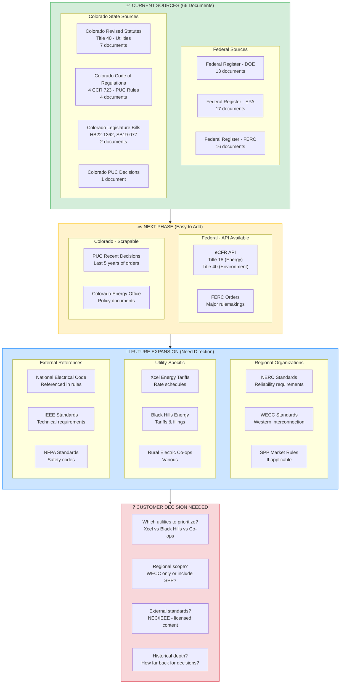
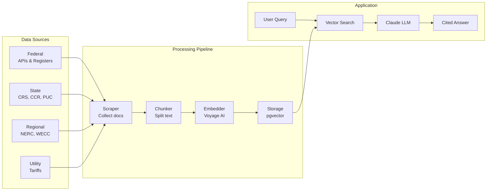

# Comask Data Sources Roadmap

## Current State & Future Direction

This diagram shows our current data sources, what we can add next, and where we need customer direction.

## Source Details

### ✅ Currently Available (66 Documents)

| Source | Type | Count | Coverage |
|--------|------|-------|----------|
| Federal Register - DOE | Federal Regulations | 13 | Energy policy, efficiency |
| Federal Register - EPA | Federal Regulations | 17 | Environmental, air quality |
| Federal Register - FERC | Federal Regulations | 16 | Transmission, markets |
| Colorado Revised Statutes | State Law | 7 | Title 40 utilities law |
| Colorado Code of Regulations | State Rules | 4 | PUC implementation rules |
| Colorado Legislature | State Bills | 2 | Recent energy legislation |
| Colorado PUC | State Decisions | 1 | Commission orders |

### 🔜 Next Phase (2-3 weeks to implement)

| Source | Effort | Value | Notes |
|--------|--------|-------|-------|
| eCFR API | Low | High | Full federal energy regulations |
| FERC Major Orders | Medium | High | Key market/transmission rules |
| PUC Decisions (5yr) | Medium | High | ~500+ relevant decisions |
| Colorado Energy Office | Low | Medium | Policy guidance docs |

### 🎯 Future Expansion (Need customer input)

| Source | Effort | Value | Blocker |
|--------|--------|-------|---------|
| NERC Standards | Medium | High | Which standards apply? |
| WECC Standards | Medium | Medium | Regional scope decision |
| Xcel Tariffs | High | High | PDF parsing complexity |
| Black Hills Tariffs | High | Medium | Lower priority? |
| NEC/IEEE | High | Medium | Licensed content - cost |

## Questions for Sasha

1. **Utility Priority**: Which utility's tariffs matter most?
   - Xcel Energy (largest in Colorado)
   - Black Hills Energy
   - Rural co-ops
   - All of the above?

2. **Regional Scope**: How important are regional standards?
   - NERC (national reliability)
   - WECC (western region)
   - SPP (if any Colorado overlap)

3. **Historical Depth**: For PUC decisions, how far back?
   - Last 2 years (recent precedent)
   - Last 5 years (standard practice)
   - Last 10 years (comprehensive)

4. **External Standards**: Worth the investment?
   - NEC (National Electrical Code) - referenced often
   - IEEE standards - technical specs
   - These are licensed/paid content

## Data Flow Architecture

## Recommended Next Steps

Based on attorney use cases, we recommend this priority:

1. **Immediate** (before production)
   - eCFR Title 18 (federal energy regulations)
   - Colorado PUC decisions (last 5 years)

2. **Short-term** (first month)
   - NERC reliability standards
   - Xcel Energy tariffs (if prioritized)

3. **Medium-term** (based on feedback)
   - Additional utilities
   - Regional standards (WECC/SPP)
   - Historical expansion

**The key question for Sasha**: Which direction adds the most value for your practice?
