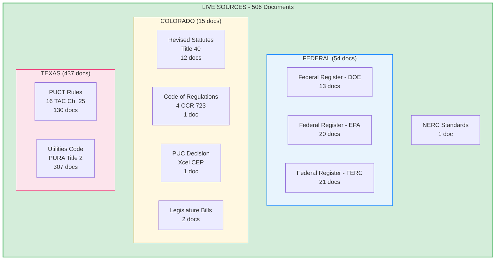
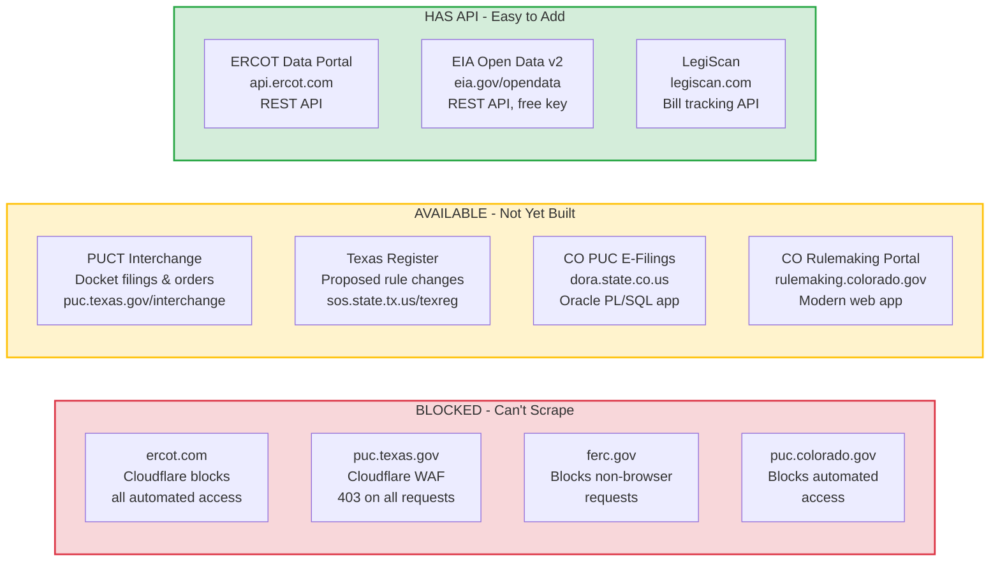
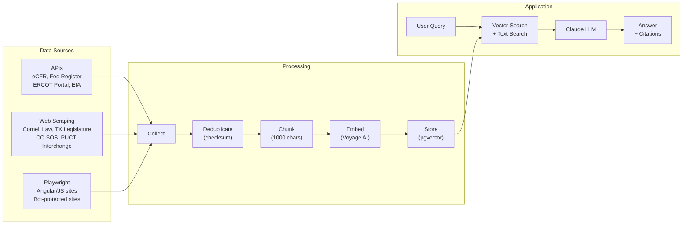

# Comask Data Sources Roadmap

> Last updated: Feb 2026 | 506 documents across 2 jurisdictions

---

## What We Have Today



### Source Breakdown

| Jurisdiction | Source | Docs | Scraped From | Method |
|---|---|---|---|---|
| Federal | Federal Register (DOE/EPA/FERC) | 54 | federalregister.gov | API |
| Colorado | Revised Statutes (Title 40) | 12 | colorado.public.law | HTTP |
| Colorado | Code of Regulations | 1 | sos.state.co.us | HTTP |
| Colorado | PUC Decision | 1 | xcelenergy.com | HTTP |
| Colorado | Legislature Bills | 2 | leg.colorado.gov | HTTP |
| NERC | Reliability Standards | 1 | nerc.com | HTTP |
| **Texas** | **PUCT Substantive Rules** | **130** | **law.cornell.edu** (TAC mirror) | HTTP + BS4 |
| **Texas** | **Utilities Code (PURA)** | **307** | **statutes.capitol.texas.gov** | Playwright |

### URL Validation Status

| Domain | URLs | Status |
|---|---|---|
| www.law.cornell.edu | 130 | All OK |
| statutes.capitol.texas.gov | 8 | All OK |
| www.federalregister.gov | 53 | All OK (some slow) |
| colorado.public.law | 1 | OK |
| leg.colorado.gov | 2 | OK |
| www.sos.state.co.us | 2 | OK |
| www.nerc.com | 1 | OK |
| drive.google.com | 1 | OK |
| www.xcelenergy.com | 1 | OK |
| **Total** | **200** | **200/200 verified** |

---

## What We Don't Have (and Why)



### Detailed Gap Analysis

#### BLOCKED (Requires Workaround)

| Source | What It Has | Why Blocked | Workaround |
|---|---|---|---|
| ercot.com | Market rules, protocols, operating guides | Cloudflare WAF blocks all non-browser requests, even Playwright | Use ERCOT Data Portal API instead (api.ercot.com) |
| puc.texas.gov | PUCT decisions, filings, docket search | Cloudflare WAF, 403 on all automated requests | PUCT Interchange (interchange.puc.texas.gov) is less protected |
| ferc.gov | FERC orders, fact sheets, guidance | 403 on all programmatic access | Federal Register has the same orders; FERC eLibrary is an alternative |
| puc.colorado.gov | CO PUC proceedings, orders, filings | Blocks bots with 403 | CO PUC E-Filings system at dora.state.co.us is accessible |

#### AVAILABLE BUT NOT YET BUILT

| Source | What It Adds | Effort | Priority | Notes |
|---|---|---|---|---|
| **PUCT Interchange** | Active dockets, commission orders, enforcement | Medium | **HIGH** | ASP.NET app, scrapable with Playwright. Daily filings search is the easiest entry point. This is where you see what PUCT is *deciding right now*. |
| **Texas Register** | Proposed rules, adopted rules, rule amendments | Medium | **HIGH** | Weekly publication. This is the early warning system - know about rule changes *before* they take effect. |
| **TX SOS Official TAC** | Authoritative 16 TAC text (we use Cornell Law mirror) | Low | **HIGH** | texreg.sos.state.tx.us - upgrade from secondary source to official source. Oracle PL/SQL, predictable URLs, no bot blocking. |
| **CO PUC E-Filings** | Active proceedings, commission decisions | Medium | **HIGH** | Oracle PL/SQL web app. Form-based POST search. No login required. |
| **CO Rulemaking Portal** | Proposed rules across all CO agencies | Medium | **HIGH** | rulemaking.colorado.gov - modern web app, likely has JSON endpoints. |
| **Railroad Commission (RRC)** | Natural gas, pipeline rules (16 TAC Ch. 1-20) | Medium | **HIGH** | Already in jurisdiction_config.py but no scraper built. Data downloads available in CSV/ASCII. |
| **CO SOS - CCR eDocket** | Official Code of Colorado Regulations | Low | **MEDIUM** | Downloadable PDFs via predictable URLs. Complements our CRS data. |
| **FERC eLibrary** | 2M+ FERC orders, filings, proceedings | Medium | **MEDIUM** | elibrary.ferc.gov - community scraper exists on GitHub. |
| **CDPHE/AQCC** | CO greenhouse gas rules, clean heat standards | Medium | **MEDIUM** | Increasingly important as CO climate laws expand. |
| **NERC/Texas RE/WECC** | Reliability standards, enforcement records | Medium | **MEDIUM** | Standards are PDFs on public sites. Critical for bulk electric system operators. |

#### HAS API (Easiest to Integrate)

| Source | API | What It Adds | Free? |
|---|---|---|---|
| **ERCOT Data Portal** | api.ercot.com (REST) | Market data, grid operations, pricing | Yes (public data) |
| **EIA Open Data v2** | eia.gov/opendata (REST) | Generation, capacity, emissions by state | Yes (free API key) |
| **LegiScan** | legiscan.com (REST) | Pending TX/CO energy legislation | Yes (30k queries/mo) |
| **eCFR** | ecfr.gov/api (REST) | Already built - federal regs Titles 18 & 40 | Yes |

---

## Architecture



---

## Recommended Next Steps

### Phase 1: Dynamic Regulatory Activity (biggest gap)

Right now we have **static rule text** but no **live regulatory activity**. Adding these closes the gap:

| Build This | Because |
|---|---|
| PUCT Interchange scraper | See what PUCT is deciding *right now* - orders, enforcement, rate cases |
| Texas Register scraper | Know about rule changes *before* they take effect |
| CO PUC E-Filings scraper | Same as PUCT Interchange but for Colorado |
| CO Rulemaking Portal scraper | Track proposed rules across all CO agencies |

### Phase 2: Source Quality Upgrades

| Build This | Because |
|---|---|
| TX SOS Official TAC | Upgrade PUCT rules from Cornell Law mirror to official authoritative source |
| RRC Texas scraper | Natural gas/pipeline regulations - already configured, no scraper built |
| CO CCR eDocket | Official administrative rules to complement our statutes data |

### Phase 3: API Integrations (low effort, high context)

| Build This | Because |
|---|---|
| ERCOT Data Portal API | Replace broken ercot.com scraper with proper API access |
| EIA v2 API | State-level energy generation, emissions, capacity data for context |
| LegiScan API | Track pending energy legislation in both TX and CO legislatures |

---

## Quick Reference: What's Live vs What's Possible

```
TEXAS                              COLORADO                          FEDERAL
-----------                        -----------                       -----------
[LIVE] PUCT Rules (130)            [LIVE] CRS Title 40 (12)          [LIVE] Fed Register (54)
[LIVE] PURA Statutes (307)         [LIVE] CCR (1)                    [LIVE] eCFR scraper (built)
[    ] PUCT Interchange            [LIVE] PUC Decision (1)           [LIVE] NERC (1)
[    ] Texas Register              [LIVE] Legislature (2)            [    ] FERC eLibrary
[    ] TX SOS Official TAC         [    ] PUC E-Filings              [    ] EIA API
[    ] Railroad Commission         [    ] Rulemaking Portal          [    ] LegiScan
[    ] TCEQ Environmental          [    ] CCR eDocket
[BLOCKED] ercot.com                [    ] CDPHE/AQCC
[    ] ERCOT API (workaround)      [BLOCKED] puc.colorado.gov
[    ] ERCOT NPRR Tracker
```

**[LIVE]** = Scraped, stored, searchable
**[    ]** = Buildable, source is accessible
**[BLOCKED]** = Site blocks automated access, needs workaround
