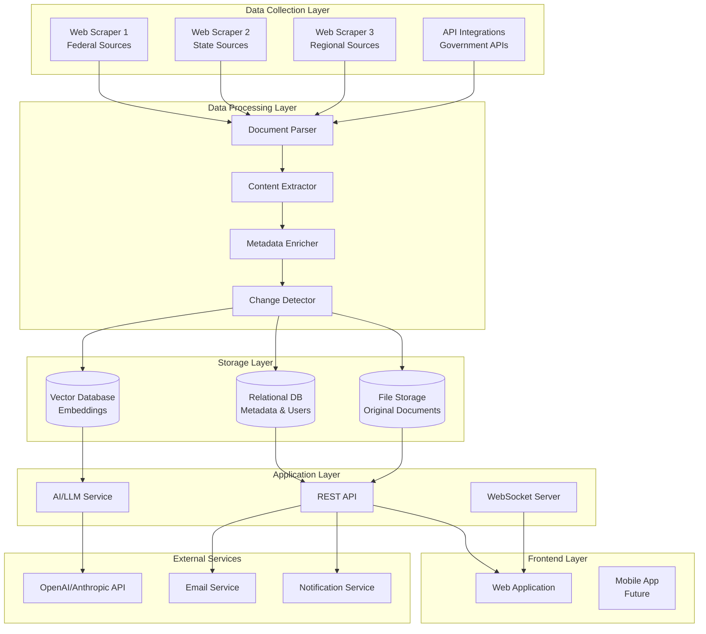
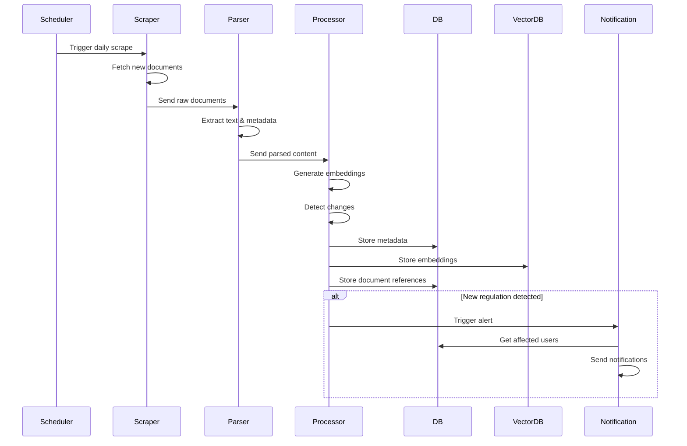
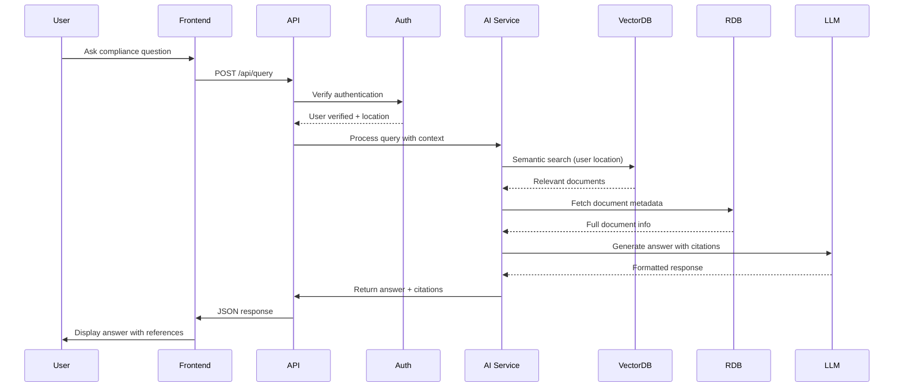
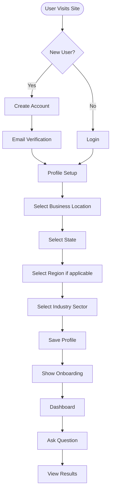
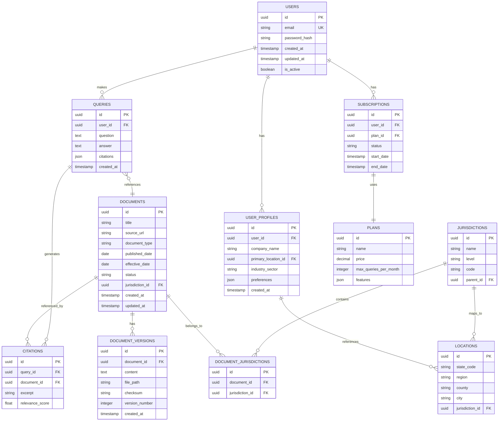
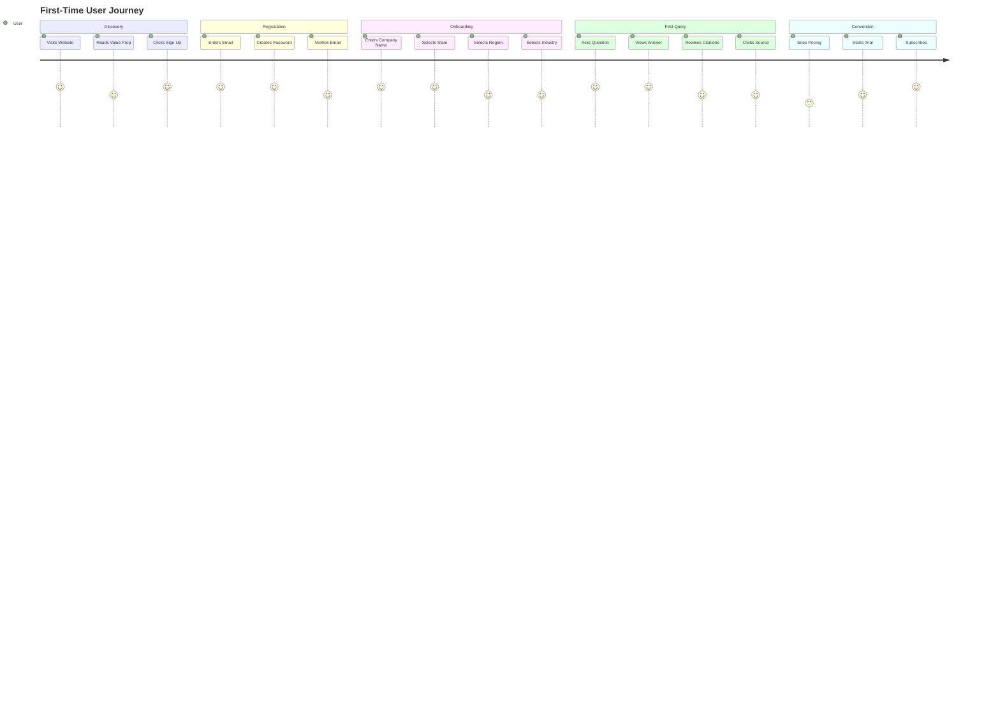
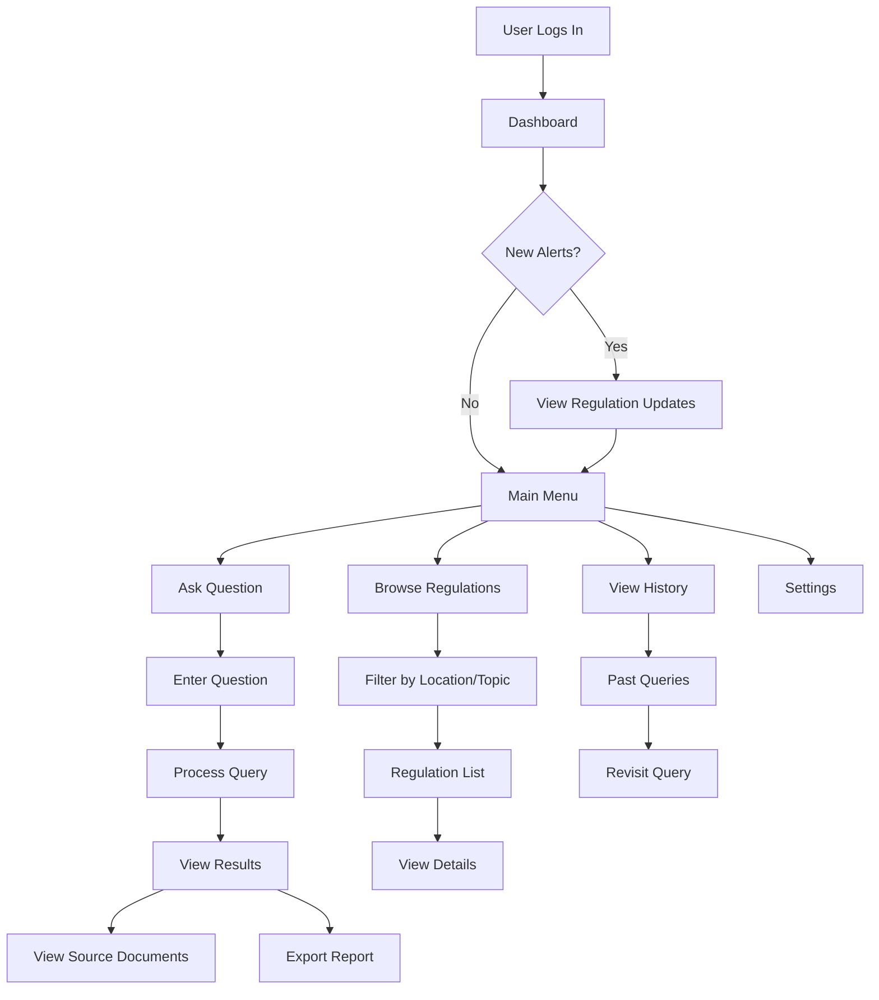
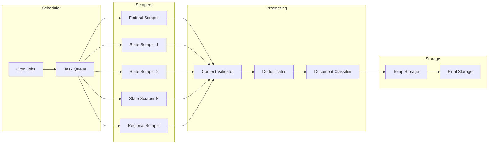
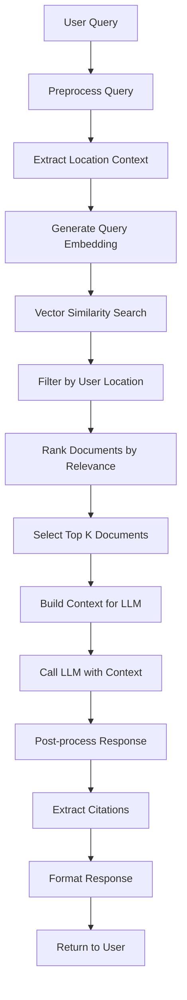

# Energy Sector Compliance Checker - Product Blueprint

## Executive Summary

This document outlines the strategy, architecture, and implementation plan for an AI-powered compliance checker tool for the energy sector. The product addresses the critical need for businesses to understand and comply with ever-changing federal, state, and regional regulations in the energy industry.

**Value Proposition**: Provide real-time, location-specific compliance answers based on the most recent regulations, laws, and policies, eliminating the need for expensive consultants.

**Target Market**: Energy sector businesses (grid operators, energy providers, renewable energy companies) operating in the United States.

**Revenue Model**: Subscription-based at ~$100/month per organization.

---

## 1. Product Overview

### 1.1 Core Functionality

1. **Question-Answer System**: Users ask compliance questions in natural language (e.g., "Can I install solar panels on residential properties in California?")
2. **Location-Aware Responses**: Answers are filtered based on user's business location (state, region, federal level)
3. **Document Referencing**: Every answer includes citations to specific regulations, laws, or policies
4. **Real-Time Updates**: Database is updated regularly with new regulations and policy changes
5. **Historical Context**: Access to past regulations and enforcement actions

### 1.2 Key Features

- **Multi-Jurisdictional Support**: Federal, state, and regional regulations
- **Natural Language Interface**: Conversational Q&A powered by AI
- **Document Search & Retrieval**: Full-text search across all stored regulations
- **Alert System**: Notifications when relevant regulations change
- **Compliance Dashboard**: Overview of applicable regulations by location
- **Export Capabilities**: Generate compliance reports with citations

---

## 2. System Architecture

### 2.1 High-Level Architecture



### 2.2 Component Breakdown

#### Data Collection Layer
- **Web Scrapers**: Automated bots that crawl government websites, regulatory bodies, and policy databases
- **API Integrations**: Direct connections to government APIs where available
- **RSS/Feed Monitors**: Track RSS feeds from regulatory agencies
- **Email Subscriptions**: Monitor regulatory email alerts

#### Data Processing Layer
- **Document Parser**: Extract text from PDFs, HTML, Word documents
- **Content Extractor**: Identify key information (dates, jurisdictions, topics)
- **Metadata Enricher**: Add tags, categories, jurisdiction info
- **Change Detector**: Compare new documents with existing ones to identify updates

#### Storage Layer
- **Vector Database**: Store document embeddings for semantic search (Pinecone, Weaviate, or Qdrant)
- **Relational Database**: Store metadata, user data, subscriptions (PostgreSQL)
- **File Storage**: Store original documents (S3 or similar)

#### Application Layer
- **REST API**: Handle user requests, authentication, data retrieval
- **WebSocket Server**: Real-time updates for regulation changes
- **AI Service**: Process questions, generate answers with citations

---

## 3. Data Flow Diagrams

### 3.1 Data Ingestion Flow



### 3.2 User Query Flow



### 3.3 User Registration & Profile Setup



---

## 4. Database Schema

### 4.1 Core Tables



---

## 5. User Flows

### 5.1 First-Time User Journey



### 5.2 Daily User Flow



---

## 6. Scraping Strategy

### 6.1 Data Sources

#### Federal Level
- **FERC (Federal Energy Regulatory Commission)**: https://www.ferc.gov
- **DOE (Department of Energy)**: https://www.energy.gov
- **EPA (Environmental Protection Agency)**: Energy-related regulations
- **Federal Register**: https://www.federalregister.gov

#### State Level
- **State Public Utility Commissions (PUCs)**: All 50 states
- **State Energy Offices**: State-specific energy regulations
- **State Legislature Websites**: Energy-related bills and laws

#### Regional Level
- **RTOs/ISOs**: Regional Transmission Organizations
  - PJM, ERCOT, CAISO, MISO, NYISO, ISO-NE, SPP
- **Regional Energy Associations**

### 6.2 Scraping Architecture



### 6.3 Scraping Frequency

- **Federal Sources**: Daily
- **State Sources**: Every 2-3 days (rotating schedule)
- **Regional Sources**: Daily
- **High-Priority Sources**: Multiple times per day

### 6.4 Document Types to Scrape

1. **Regulations**: Final rules, proposed rules
2. **Orders**: Regulatory orders and decisions
3. **Guidance Documents**: Agency guidance and interpretations
4. **Enforcement Actions**: Fines, penalties, compliance actions
5. **Legislation**: Bills, acts, statutes
6. **Notices**: Public notices, comment periods
7. **Reports**: Annual reports, compliance reports

---

## 7. AI/LLM Integration

### 7.1 Query Processing Pipeline



### 7.2 Prompt Engineering Strategy

**System Prompt Template**:
```
You are a compliance expert for the energy sector. Your role is to answer questions 
about energy regulations, laws, and policies based on the provided documents.

Rules:
1. Only use information from the provided documents
2. Always cite specific documents and sections
3. If information is not available, state that clearly
4. Consider the user's location (state, region) when applicable
5. Mention the date of the regulation to indicate recency
6. If regulations conflict, mention both and explain the hierarchy
```

**User Prompt Template**:
```
User Location: {state}, {region}
User Question: {question}

Relevant Documents:
{document_1_title} (Published: {date_1})
{document_1_excerpt}

{document_2_title} (Published: {date_2})
{document_2_excerpt}

...

Please provide a comprehensive answer with specific citations.
```

### 7.3 Citation Format

Each answer should include:
- Document title
- Source URL
- Publication date
- Relevant section/paragraph
- Excerpt from the document

---

## 8. API Design

### 8.1 Core Endpoints

#### Authentication
- `POST /api/auth/register` - User registration
- `POST /api/auth/login` - User login
- `POST /api/auth/logout` - User logout
- `POST /api/auth/refresh` - Refresh token

#### User Profile
- `GET /api/profile` - Get user profile
- `PUT /api/profile` - Update user profile
- `PUT /api/profile/location` - Update location

#### Queries
- `POST /api/queries` - Submit a compliance question
- `GET /api/queries` - Get query history
- `GET /api/queries/:id` - Get specific query
- `GET /api/queries/:id/export` - Export query as PDF

#### Documents
- `GET /api/documents` - Search/browse documents
- `GET /api/documents/:id` - Get document details
- `GET /api/documents/:id/content` - Get document content
- `GET /api/documents/recent` - Get recently added documents

#### Regulations
- `GET /api/regulations` - Get regulations by location
- `GET /api/regulations/:id` - Get specific regulation
- `GET /api/regulations/changes` - Get recent changes

#### Subscriptions
- `GET /api/subscriptions` - Get subscription status
- `POST /api/subscriptions` - Create subscription
- `PUT /api/subscriptions` - Update subscription
- `DELETE /api/subscriptions` - Cancel subscription

### 8.2 API Response Format

```json
{
  "success": true,
  "data": {
    "answer": "Based on the most recent regulations...",
    "citations": [
      {
        "document_id": "uuid",
        "title": "California Solar Energy Regulations",
        "url": "https://...",
        "published_date": "2024-01-15",
        "excerpt": "Relevant text excerpt...",
        "relevance_score": 0.95
      }
    ],
    "confidence": 0.92,
    "query_id": "uuid",
    "timestamp": "2024-01-20T10:30:00Z"
  }
}
```

---

## 9. Technology Stack Recommendations

### 9.1 Backend
- **Language**: Python (FastAPI) or Node.js (Express/NestJS)
- **Database**: PostgreSQL (metadata), Vector DB (Pinecone/Weaviate/Qdrant)
- **File Storage**: AWS S3 or similar
- **Queue**: Redis + Celery (Python) or Bull (Node.js)
- **Cache**: Redis

### 9.2 Frontend
- **Framework**: React/Next.js or Vue/Nuxt
- **UI Library**: Tailwind CSS + shadcn/ui or Material-UI
- **State Management**: Zustand or Redux
- **Real-time**: WebSocket or Server-Sent Events

### 9.3 Scraping
- **Framework**: Scrapy (Python) or Puppeteer/Playwright
- **Scheduling**: APScheduler or node-cron
- **Storage**: PostgreSQL for metadata, S3 for files

### 9.4 AI/ML
- **LLM**: OpenAI GPT-4 or Anthropic Claude
- **Embeddings**: OpenAI text-embedding-3 or sentence-transformers
- **Vector DB**: Pinecone, Weaviate, or Qdrant

### 9.5 Infrastructure
- **Hosting**: AWS, GCP, or Azure
- **Containerization**: Docker + Kubernetes (optional)
- **CI/CD**: GitHub Actions or GitLab CI
- **Monitoring**: Sentry, DataDog, or New Relic

---

## 10. Implementation Phases

### Phase 1: MVP (Weeks 1-4)
**Goal**: Basic Q&A functionality with limited data sources

- [ ] Set up project structure
- [ ] Implement user authentication
- [ ] Build basic scraper for 2-3 federal sources
- [ ] Set up database schema
- [ ] Implement document storage
- [ ] Build basic vector search
- [ ] Integrate LLM for Q&A
- [ ] Create simple web interface
- [ ] Deploy to staging

**Deliverables**:
- Working prototype with federal regulations
- Basic Q&A interface
- User registration/login

### Phase 2: Enhanced Data Collection (Weeks 5-8)
**Goal**: Expand data sources and improve scraping

- [ ] Add state-level scrapers (start with 5-10 states)
- [ ] Add regional scrapers (RTOs/ISOs)
- [ ] Implement change detection
- [ ] Build notification system
- [ ] Improve document parsing
- [ ] Add metadata enrichment

**Deliverables**:
- Multi-jurisdictional data coverage
- Change detection working
- Email notifications for updates

### Phase 3: Advanced Features (Weeks 9-12)
**Goal**: Enhanced user experience and features

- [ ] Implement user profiles with location
- [ ] Add location-based filtering
- [ ] Build regulation browser
- [ ] Add query history
- [ ] Implement export functionality
- [ ] Add dashboard with insights
- [ ] Improve citation accuracy

**Deliverables**:
- Full-featured web application
- Location-aware responses
- Regulation browsing

### Phase 4: Production Ready (Weeks 13-16)
**Goal**: Scale and polish for production

- [ ] Add subscription management
- [ ] Implement payment processing (Stripe)
- [ ] Add rate limiting
- [ ] Optimize performance
- [ ] Add comprehensive error handling
- [ ] Implement logging and monitoring
- [ ] Security audit
- [ ] Load testing
- [ ] Documentation

**Deliverables**:
- Production-ready application
- Payment integration
- Monitoring and logging

### Phase 5: Scale & Expand (Ongoing)
**Goal**: Continuous improvement and expansion

- [ ] Add all 50 states
- [ ] Expand to other sectors (future)
- [ ] Mobile app (future)
- [ ] API for enterprise customers
- [ ] Advanced analytics
- [ ] Multi-language support (future)

---

## 11. Key Features Deep Dive

### 11.1 Question-Answer System

**Input Processing**:
1. Parse user question
2. Extract location context (if mentioned)
3. Identify question type (compliance, regulation, enforcement)
4. Generate query embedding

**Retrieval**:
1. Vector similarity search in user's jurisdiction
2. Filter by document type if applicable
3. Rank by relevance and recency
4. Select top 5-10 documents

**Answer Generation**:
1. Build context with retrieved documents
2. Call LLM with structured prompt
3. Extract citations from response
4. Validate citations against source documents
5. Format response with citations

### 11.2 Location-Aware Filtering

**Jurisdiction Hierarchy**:
```
Federal
  └── Regional (RTO/ISO)
      └── State
          └── County (if applicable)
              └── City (if applicable)
```

**Filtering Logic**:
- User's primary location determines base jurisdiction
- Federal regulations always included
- Regional regulations if user is in that region
- State regulations for user's state
- Lower-level regulations override higher-level when applicable

### 11.3 Change Detection

**Process**:
1. Calculate document checksum/hash
2. Compare with stored version
3. If different, extract changes
4. Identify affected users
5. Send notifications

**Change Types**:
- New regulation added
- Existing regulation updated
- Regulation repealed
- Enforcement action added

### 11.4 Citation System

**Citation Components**:
- Document ID
- Title
- Source URL
- Publication date
- Effective date (if different)
- Section/paragraph reference
- Excerpt with highlighting
- Relevance score

**Display Format**:
```
Answer: [Generated answer]

Sources:
1. [Document Title] (Published: [Date])
   [Excerpt]
   [Link to full document]
   
2. [Document Title] (Published: [Date])
   [Excerpt]
   [Link to full document]
```

---

## 12. Security Considerations

### 12.1 Data Security
- Encrypt documents at rest
- Use HTTPS for all communications
- Implement API rate limiting
- Secure API keys and credentials
- Regular security audits

### 12.2 User Privacy
- GDPR/CCPA compliance
- User data encryption
- Privacy policy
- Data retention policies
- User data export/deletion

### 12.3 Access Control
- Role-based access control (RBAC)
- JWT authentication
- Session management
- IP whitelisting (for enterprise)

---

## 13. Monetization Strategy

### 13.1 Pricing Tiers

**Starter Plan - $99/month**
- 100 queries per month
- Federal + 1 state
- Email support
- Basic citations

**Professional Plan - $299/month**
- 500 queries per month
- Federal + all states
- Priority support
- Advanced citations
- Export reports

**Enterprise Plan - Custom**
- Unlimited queries
- All jurisdictions
- Dedicated support
- API access
- Custom integrations
- SLA guarantees

### 13.2 Revenue Projections

**Year 1**:
- Month 1-3: 10 customers @ $99 = $990/month
- Month 4-6: 25 customers @ $99 = $2,475/month
- Month 7-9: 50 customers @ $99 = $4,950/month
- Month 10-12: 100 customers @ $99 = $9,900/month

**Year 2** (with Professional tier):
- Average: 200 customers @ $150 avg = $30,000/month

---

## 14. Success Metrics

### 14.1 Product Metrics
- Query accuracy rate (target: >90%)
- Response time (target: <5 seconds)
- Citation relevance (target: >85%)
- User satisfaction score (target: >4.5/5)

### 14.2 Business Metrics
- Monthly Recurring Revenue (MRR)
- Customer Acquisition Cost (CAC)
- Customer Lifetime Value (LTV)
- Churn rate (target: <5%)
- Net Promoter Score (NPS)

### 14.3 Technical Metrics
- Uptime (target: 99.9%)
- API response time
- Scraping success rate
- Data freshness (target: <48 hours)

---

## 15. Risk Assessment & Mitigation

### 15.1 Technical Risks

**Risk**: Scraping websites change structure
**Mitigation**: 
- Robust error handling
- Regular monitoring
- Fallback to manual collection
- Multiple data sources

**Risk**: LLM provides inaccurate information
**Mitigation**:
- Always require citations
- Human review process
- Confidence scoring
- User feedback loop

**Risk**: High infrastructure costs
**Mitigation**:
- Optimize vector search
- Cache frequently accessed data
- Use cost-effective LLM models
- Monitor and optimize usage

### 15.2 Business Risks

**Risk**: Low adoption
**Mitigation**:
- Start with existing client
- Focus on specific use cases
- Provide excellent support
- Iterate based on feedback

**Risk**: Regulatory changes affect business model
**Mitigation**:
- Diversify revenue streams
- Build flexible architecture
- Stay informed about regulations

---

## 16. Future Enhancements

### 16.1 Short-term (3-6 months)
- Mobile app (iOS/Android)
- Browser extension
- Slack/Teams integration
- Advanced search filters
- Saved queries and alerts

### 16.2 Medium-term (6-12 months)
- Multi-language support
- Expand to other sectors (finance, healthcare)
- AI-powered compliance recommendations
- Compliance checklist generator
- Integration with compliance software

### 16.3 Long-term (12+ months)
- Predictive compliance analytics
- Automated compliance monitoring
- White-label solution
- Enterprise API
- International expansion

---

## 17. Team Requirements

### 17.1 Core Team (MVP)
- **1 Full-stack Developer**: Backend + Frontend
- **1 Data Engineer**: Scraping + Data processing
- **1 AI/ML Engineer**: LLM integration + Vector search
- **0.5 Designer**: UI/UX design
- **0.5 Product Manager**: Product strategy

### 17.2 Extended Team (Scale)
- Additional developers
- DevOps engineer
- Customer success manager
- Sales/marketing

---

## 18. Conclusion

This blueprint provides a comprehensive roadmap for building an energy sector compliance checker. The product addresses a real market need with a clear value proposition and monetization strategy.

**Key Success Factors**:
1. Accurate and up-to-date data
2. Fast, reliable responses
3. Trustworthy citations
4. Excellent user experience
5. Strong initial customer relationship

**Next Steps**:
1. Review and refine this blueprint
2. Set up development environment
3. Begin Phase 1 implementation
4. Establish data partnerships
5. Start building MVP

---

## Appendix A: Mermaid Diagram Summary

This document includes the following mermaid diagrams:
1. High-Level System Architecture
2. Data Ingestion Flow (Sequence)
3. User Query Flow (Sequence)
4. User Registration Flow (Flowchart)
5. First-Time User Journey
6. Daily User Flow (Flowchart)
7. Database Schema (ERD)
8. Scraping Architecture
9. Query Processing Pipeline

---

*Document Version: 1.0*  
*Last Updated: [Current Date]*  
*Author: Product Team*

