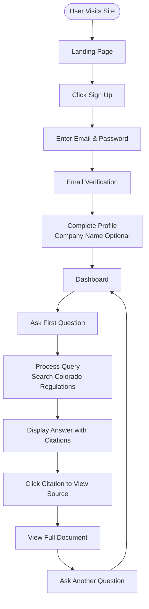
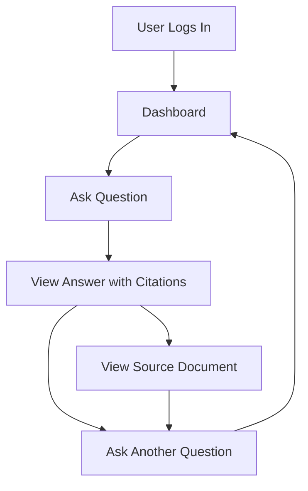
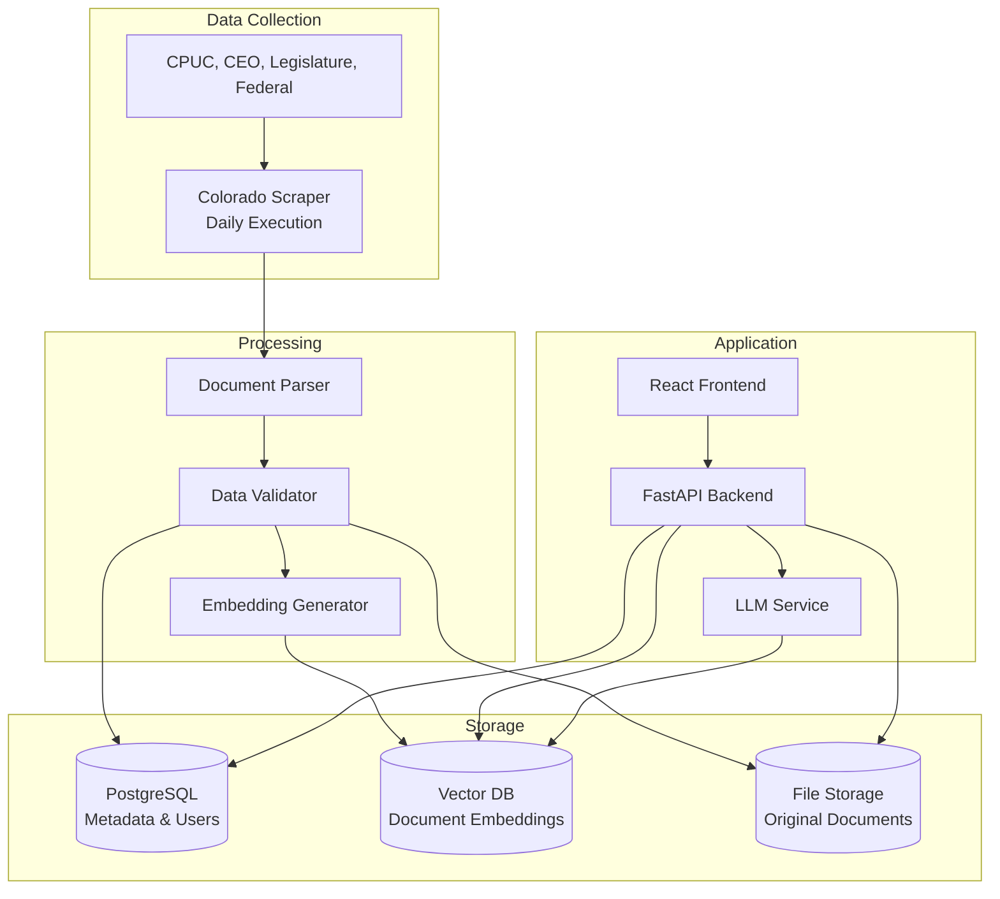

# MVP Scope Document - Colorado Energy Compliance Checker

## Executive Summary

This document defines the Minimum Viable Product (MVP) scope for the Energy Sector Compliance Checker, focusing exclusively on **Colorado** energy regulations. The MVP will deliver two core promises:

1. **Latest Data**: Users get answers based on the most recent regulations available
2. **Super Accurate Answers**: Every answer is backed by specific, verifiable citations from source documents

**Timeline**: 4-6 weeks  
**Target Market**: Energy sector businesses operating in Colorado  
**Success Criteria**: 100% functional on all promised features

---

## Core Principles

### 1. Less is More
- Focus on Colorado only (no other states)
- Single jurisdiction simplifies complexity
- Allows for deep, accurate coverage

### 2. 100% Functional
- Every feature promised will work perfectly
- No "coming soon" or "beta" features
- Quality over quantity

### 3. Latest Data Promise
- Data updated within 48 hours of publication
- Clear indication of data freshness
- Automated monitoring and alerts

### 4. Accuracy Promise
- Every answer includes specific citations
- Users can verify every claim
- No hallucinations or unsupported statements

---

## MVP Scope: What's IN

### 1. Data Coverage

#### 1.1 Colorado-Specific Sources
- **Colorado Public Utilities Commission (CPUC)**
  - All orders and decisions
  - Rulemakings and regulations
  - Docket filings
  - Update frequency: Daily

- **Colorado Energy Office (CEO)**
  - Energy regulations and policies
  - Renewable energy standards
  - Energy efficiency requirements
  - Update frequency: Every 2 days

- **Colorado State Legislature**
  - Energy-related bills (when passed)
  - Energy-related statutes
  - Update frequency: Weekly (during session), monthly (off-session)

- **Federal Regulations (Colorado-specific application)**
  - FERC orders affecting Colorado
  - Federal Register entries relevant to Colorado
  - Update frequency: Daily

#### 1.2 Document Types
- Regulations and rules
- Commission orders
- Legislative statutes
- Policy guidance documents
- Enforcement actions (if publicly available)

#### 1.3 Data Freshness
- **Maximum age**: 48 hours from publication
- **Update frequency**: Daily scraping
- **Change detection**: Automatic alerts for new/updated regulations
- **Data freshness indicator**: Visible on every answer

### 2. Core Functionality

#### 2.1 User Authentication
- **Email/password registration**
- **Email verification** (required)
- **Login/logout**
- **Password reset** (email-based)
- **Session management** (JWT tokens)

#### 2.2 User Profile
- **Company name** (optional)
- **Primary location**: Colorado (pre-selected, not editable in MVP)
- **Email notifications** (opt-in for regulation updates)

#### 2.3 Question-Answer System
- **Natural language questions** about Colorado energy regulations
- **Location context**: Automatically filtered to Colorado
- **Answer generation**: Based on latest scraped data
- **Response time**: < 5 seconds
- **Answer format**: 
  - Clear, concise answer
  - Specific citations (minimum 1, typically 2-5)
  - Data freshness indicator

#### 2.4 Citation System
- **Document title**
- **Source URL** (clickable)
- **Publication date**
- **Effective date** (if different)
- **Relevant excerpt** (highlighted text from source)
- **Document type** (regulation, order, statute, etc.)

#### 2.5 Document Viewing
- **View full document** (original source)
- **Download document** (PDF/HTML as available)
- **Document metadata** (dates, status, type)

### 3. Technical Requirements

#### 3.1 Data Collection
- **Automated scraping** of Colorado sources
- **Daily execution** (scheduled)
- **Change detection** (compare with existing documents)
- **Error handling** (log failures, retry logic)
- **Duplicate detection** (prevent storing same document twice)

#### 3.2 Data Storage
- **PostgreSQL** for metadata and user data
- **Vector database** for semantic search (Pinecone/Weaviate/Qdrant)
- **File storage** for original documents (S3 or local)
- **Backup strategy** (daily backups)

#### 3.3 AI/LLM Integration
- **Query processing**: Extract location context, generate embeddings
- **Vector search**: Find relevant documents (top 5-10)
- **Answer generation**: LLM with strict citation requirements
- **Citation extraction**: Parse and validate citations from LLM response
- **Model**: GPT-4 or Claude (for accuracy)

#### 3.4 Web Application
- **Responsive design** (works on desktop and tablet)
- **Clean, simple interface**
- **Question input** (text area)
- **Answer display** (formatted with citations)
- **Document viewer** (modal or new page)
- **User dashboard** (profile, recent queries)

### 4. Quality Assurance

#### 4.1 Data Quality
- **Validation**: Every scraped document validated before storage
- **Completeness**: Required metadata fields must be present
- **Accuracy**: Source URLs must be valid and accessible
- **Freshness**: Daily monitoring of data age

#### 4.2 Answer Quality
- **Citation requirement**: Every answer must have at least 1 citation
- **Citation validation**: All citations must link to real documents
- **No hallucinations**: LLM responses must be grounded in provided documents
- **Confidence scoring**: Display confidence level (if < 70%, indicate uncertainty)

#### 4.3 System Reliability
- **Uptime**: 99% availability (planned maintenance excluded)
- **Error handling**: Graceful error messages, no crashes
- **Performance**: Query response < 5 seconds (95th percentile)
- **Monitoring**: Basic logging and error tracking

---

## MVP Scope: What's OUT

### 1. Multi-State Support
- ❌ No other states (Colorado only)
- ❌ No state comparison features
- ❌ No multi-jurisdiction queries

### 2. Advanced Features
- ❌ No query history/search (basic recent queries only)
- ❌ No saved queries or favorites
- ❌ No export to PDF/Word
- ❌ No email alerts for regulation changes (in MVP)
- ❌ No dashboard analytics
- ❌ No API access
- ❌ No mobile app

### 3. Subscription/Payment
- ❌ No payment processing in MVP
- ❌ No subscription tiers
- ❌ No usage limits (but may implement basic rate limiting)
- **Note**: MVP may be free or have manual billing

### 4. Advanced Scraping
- ❌ No regional (RTO/ISO) sources (unless directly Colorado-related)
- ❌ No county/city level regulations
- ❌ No historical data beyond what's available from sources
- ❌ No enforcement action scraping (unless easily accessible)

### 5. Social/Sharing Features
- ❌ No sharing queries/answers
- ❌ No collaboration features
- ❌ No comments or annotations

### 6. Advanced AI Features
- ❌ No multi-turn conversations
- ❌ No query suggestions
- ❌ No answer explanations beyond citations
- ❌ No compliance checklist generation

---

## MVP User Flow

### New User Journey

### Returning User Journey

---

## Technical Architecture (MVP)

### Simplified Architecture

### Technology Stack (MVP)

**Backend**:
- Python 3.11+
- FastAPI (API framework)
- PostgreSQL 15+ (database)
- Pinecone/Weaviate/Qdrant (vector database)
- OpenAI API or Anthropic API (LLM)
- Celery + Redis (background tasks)

**Frontend**:
- React 18+ or Next.js 14+
- Tailwind CSS (styling)
- Axios (API client)

**Scraping**:
- Scrapy or BeautifulSoup + Requests
- APScheduler (scheduling)

**Infrastructure**:
- Docker (containerization)
- Basic deployment (VPS or cloud instance)
- Nginx (reverse proxy)

---

## Data Sources (MVP - Colorado Only)

### 1. Colorado Public Utilities Commission (CPUC)
- **URL**: https://puc.colorado.gov
- **Key Pages**:
  - Orders: https://puc.colorado.gov/orders
  - Rulemakings: https://puc.colorado.gov/rulemakings
  - Dockets: https://puc.colorado.gov/dockets
- **Update Frequency**: Daily
- **Priority**: HIGH (primary source)

### 2. Colorado Energy Office (CEO)
- **URL**: https://energyoffice.colorado.gov
- **Key Pages**:
  - Regulations: https://energyoffice.colorado.gov/regulations
  - Policies: https://energyoffice.colorado.gov/policies
- **Update Frequency**: Every 2 days
- **Priority**: HIGH

### 3. Colorado General Assembly
- **URL**: https://leg.colorado.gov
- **Key Pages**:
  - Bills: Search for energy-related bills
  - Statutes: Title 40 (Utilities)
- **Update Frequency**: Weekly (during session)
- **Priority**: MEDIUM

### 4. Federal Register (Colorado-filtered)
- **URL**: https://www.federalregister.gov
- **Search**: Energy regulations affecting Colorado
- **Update Frequency**: Daily
- **Priority**: MEDIUM

### 5. FERC (Colorado-related)
- **URL**: https://www.ferc.gov
- **Filter**: Orders affecting Colorado utilities
- **Update Frequency**: Daily
- **Priority**: LOW (if time permits)

---

## Success Criteria

### Functional Requirements
- ✅ Users can register and log in
- ✅ Users can ask questions about Colorado energy regulations
- ✅ Answers are generated within 5 seconds
- ✅ Every answer has at least 1 citation
- ✅ All citations link to real, accessible documents
- ✅ Documents are viewable/downloadable
- ✅ Data is updated daily (within 48 hours of publication)
- ✅ System handles errors gracefully

### Quality Requirements
- ✅ Answer accuracy: >90% of answers are factually correct
- ✅ Citation relevance: >85% of citations are relevant to the question
- ✅ Data freshness: 100% of answers use data < 48 hours old (when available)
- ✅ System uptime: >99% availability
- ✅ No critical bugs in core functionality

### User Experience Requirements
- ✅ Interface is intuitive and easy to use
- ✅ Questions can be asked in natural language
- ✅ Answers are clear and well-formatted
- ✅ Citations are easy to access and verify
- ✅ Mobile-responsive (tablet and desktop)

---

## MVP Timeline

### Week 1: Foundation
- [ ] Set up project structure
- [ ] Set up database (PostgreSQL + Vector DB)
- [ ] Implement user authentication
- [ ] Create basic API structure
- [ ] Set up frontend project

### Week 2: Data Collection
- [ ] Build CPUC scraper
- [ ] Build CEO scraper
- [ ] Implement document parser
- [ ] Set up storage (database + file storage)
- [ ] Implement change detection
- [ ] Set up daily scraping schedule

### Week 3: Core Functionality
- [ ] Implement vector search
- [ ] Integrate LLM for answer generation
- [ ] Build citation extraction
- [ ] Create question-answer API endpoint
- [ ] Build basic frontend UI

### Week 4: Polish & Testing
- [ ] Complete frontend UI
- [ ] Implement document viewer
- [ ] Add data freshness indicators
- [ ] Comprehensive testing
- [ ] Bug fixes
- [ ] Performance optimization

### Week 5-6: Buffer & Launch Prep
- [ ] Additional testing
- [ ] User acceptance testing (if possible)
- [ ] Documentation
- [ ] Deployment setup
- [ ] Launch preparation

---

## Risk Mitigation

### Risk 1: Scraping Failures
**Mitigation**:
- Robust error handling
- Manual fallback process
- Daily monitoring
- Alert system for failures

### Risk 2: LLM Inaccuracies
**Mitigation**:
- Strict prompt engineering (require citations)
- Citation validation
- Confidence scoring
- Human review process (if needed)

### Risk 3: Data Freshness
**Mitigation**:
- Daily automated scraping
- Monitoring and alerts
- Manual update process (backup)
- Clear freshness indicators

### Risk 4: Performance Issues
**Mitigation**:
- Caching strategy
- Database optimization
- Load testing
- Performance monitoring

---

## Definition of Done

The MVP is considered complete when:

1. ✅ All "IN Scope" features are implemented and working
2. ✅ All success criteria are met
3. ✅ System has been tested with real Colorado regulations
4. ✅ Answers are accurate and properly cited
5. ✅ Data is being updated daily
6. ✅ System is deployed and accessible
7. ✅ Basic documentation is complete
8. ✅ No critical bugs exist

---

## Post-MVP Considerations

After MVP launch, potential enhancements (NOT in MVP scope):
- Additional states
- Query history and search
- Export functionality
- Email notifications
- Payment integration
- Mobile app
- API access
- Advanced analytics

---

## Notes

- **Focus**: Colorado only - do it perfectly
- **Quality**: Every feature must work 100%
- **Data**: Latest data is a core promise - cannot compromise
- **Accuracy**: Citations are mandatory - no unsupported answers
- **Simplicity**: Less is more - better to do fewer things perfectly

---

**Document Version**: 1.0  
**Last Updated**: [Current Date]  
**Status**: Ready for Implementation  
**Next Step**: Begin Week 1 tasks

