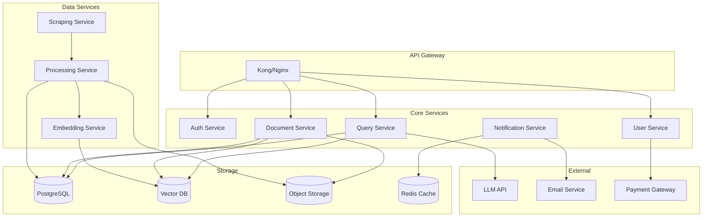
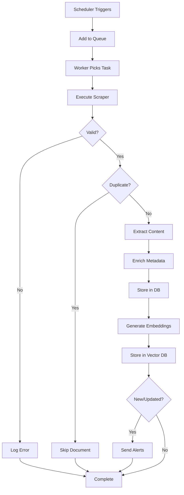
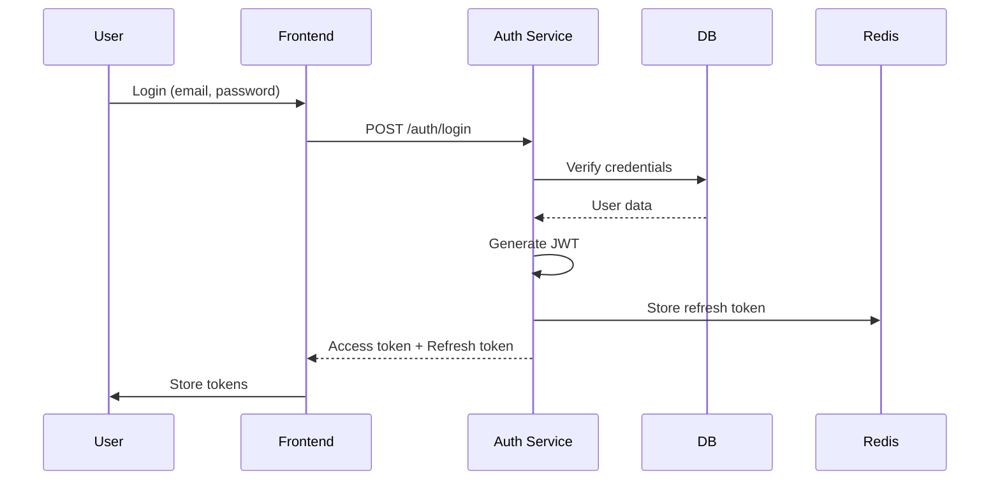

# Technical Architecture Deep Dive

## 1. System Components

### 1.1 Microservices Architecture



### 1.2 Service Communication

**Synchronous**: REST API calls between services
**Asynchronous**: Message queue (RabbitMQ/Kafka) for:
- Scraping tasks
- Document processing
- Notification delivery
- Background jobs

---

## 2. Database Design

### 2.1 PostgreSQL Schema Details

#### Users & Authentication
```sql
CREATE TABLE users (
    id UUID PRIMARY KEY DEFAULT gen_random_uuid(),
    email VARCHAR(255) UNIQUE NOT NULL,
    password_hash VARCHAR(255) NOT NULL,
    email_verified BOOLEAN DEFAULT FALSE,
    created_at TIMESTAMP DEFAULT NOW(),
    updated_at TIMESTAMP DEFAULT NOW(),
    last_login TIMESTAMP,
    is_active BOOLEAN DEFAULT TRUE
);

CREATE TABLE user_sessions (
    id UUID PRIMARY KEY DEFAULT gen_random_uuid(),
    user_id UUID REFERENCES users(id) ON DELETE CASCADE,
    token_hash VARCHAR(255) NOT NULL,
    expires_at TIMESTAMP NOT NULL,
    created_at TIMESTAMP DEFAULT NOW()
);
```

#### User Profiles
```sql
CREATE TABLE user_profiles (
    id UUID PRIMARY KEY DEFAULT gen_random_uuid(),
    user_id UUID REFERENCES users(id) ON DELETE CASCADE,
    company_name VARCHAR(255),
    primary_location_id UUID REFERENCES locations(id),
    industry_sector VARCHAR(100),
    preferences JSONB DEFAULT '{}',
    created_at TIMESTAMP DEFAULT NOW(),
    updated_at TIMESTAMP DEFAULT NOW()
);

CREATE TABLE locations (
    id UUID PRIMARY KEY DEFAULT gen_random_uuid(),
    state_code CHAR(2) NOT NULL,
    region VARCHAR(100),
    county VARCHAR(100),
    city VARCHAR(100),
    jurisdiction_id UUID REFERENCES jurisdictions(id),
    created_at TIMESTAMP DEFAULT NOW()
);

CREATE INDEX idx_locations_state ON locations(state_code);
CREATE INDEX idx_locations_jurisdiction ON locations(jurisdiction_id);
```

#### Documents & Regulations
```sql
CREATE TABLE jurisdictions (
    id UUID PRIMARY KEY DEFAULT gen_random_uuid(),
    name VARCHAR(255) NOT NULL,
    level VARCHAR(50) NOT NULL, -- 'federal', 'regional', 'state', 'county', 'city'
    code VARCHAR(50),
    parent_id UUID REFERENCES jurisdictions(id),
    created_at TIMESTAMP DEFAULT NOW()
);

CREATE TABLE documents (
    id UUID PRIMARY KEY DEFAULT gen_random_uuid(),
    title TEXT NOT NULL,
    source_url TEXT NOT NULL,
    document_type VARCHAR(100), -- 'regulation', 'order', 'guidance', 'enforcement', 'legislation'
    published_date DATE,
    effective_date DATE,
    status VARCHAR(50), -- 'active', 'proposed', 'repealed', 'superseded'
    checksum VARCHAR(64) UNIQUE,
    file_path TEXT,
    metadata JSONB DEFAULT '{}',
    created_at TIMESTAMP DEFAULT NOW(),
    updated_at TIMESTAMP DEFAULT NOW()
);

CREATE TABLE document_versions (
    id UUID PRIMARY KEY DEFAULT gen_random_uuid(),
    document_id UUID REFERENCES documents(id) ON DELETE CASCADE,
    content TEXT,
    file_path TEXT,
    checksum VARCHAR(64),
    version_number INTEGER NOT NULL,
    change_summary TEXT,
    created_at TIMESTAMP DEFAULT NOW()
);

CREATE TABLE document_jurisdictions (
    id UUID PRIMARY KEY DEFAULT gen_random_uuid(),
    document_id UUID REFERENCES documents(id) ON DELETE CASCADE,
    jurisdiction_id UUID REFERENCES jurisdictions(id) ON DELETE CASCADE,
    UNIQUE(document_id, jurisdiction_id)
);

CREATE INDEX idx_documents_published ON documents(published_date DESC);
CREATE INDEX idx_documents_status ON documents(status);
CREATE INDEX idx_documents_type ON documents(document_type);
CREATE INDEX idx_doc_jurisdictions_doc ON document_jurisdictions(document_id);
CREATE INDEX idx_doc_jurisdictions_jur ON document_jurisdictions(jurisdiction_id);
```

#### Queries & Citations
```sql
CREATE TABLE queries (
    id UUID PRIMARY KEY DEFAULT gen_random_uuid(),
    user_id UUID REFERENCES users(id) ON DELETE CASCADE,
    question TEXT NOT NULL,
    answer TEXT,
    confidence_score FLOAT,
    processing_time_ms INTEGER,
    created_at TIMESTAMP DEFAULT NOW()
);

CREATE TABLE citations (
    id UUID PRIMARY KEY DEFAULT gen_random_uuid(),
    query_id UUID REFERENCES queries(id) ON DELETE CASCADE,
    document_id UUID REFERENCES documents(id) ON DELETE CASCADE,
    document_version_id UUID REFERENCES document_versions(id),
    excerpt TEXT,
    relevance_score FLOAT,
    start_position INTEGER,
    end_position INTEGER,
    created_at TIMESTAMP DEFAULT NOW()
);

CREATE INDEX idx_queries_user ON queries(user_id, created_at DESC);
CREATE INDEX idx_citations_query ON citations(query_id);
CREATE INDEX idx_citations_document ON citations(document_id);
```

#### Subscriptions
```sql
CREATE TABLE plans (
    id UUID PRIMARY KEY DEFAULT gen_random_uuid(),
    name VARCHAR(100) NOT NULL,
    price DECIMAL(10,2) NOT NULL,
    max_queries_per_month INTEGER,
    features JSONB DEFAULT '[]',
    is_active BOOLEAN DEFAULT TRUE,
    created_at TIMESTAMP DEFAULT NOW()
);

CREATE TABLE subscriptions (
    id UUID PRIMARY KEY DEFAULT gen_random_uuid(),
    user_id UUID REFERENCES users(id) ON DELETE CASCADE,
    plan_id UUID REFERENCES plans(id),
    status VARCHAR(50) NOT NULL, -- 'active', 'cancelled', 'expired', 'trial'
    start_date TIMESTAMP NOT NULL,
    end_date TIMESTAMP,
    current_period_start TIMESTAMP,
    current_period_end TIMESTAMP,
    stripe_subscription_id VARCHAR(255),
    created_at TIMESTAMP DEFAULT NOW(),
    updated_at TIMESTAMP DEFAULT NOW()
);

CREATE TABLE query_usage (
    id UUID PRIMARY KEY DEFAULT gen_random_uuid(),
    user_id UUID REFERENCES users(id) ON DELETE CASCADE,
    subscription_id UUID REFERENCES subscriptions(id),
    query_id UUID REFERENCES queries(id),
    period_start TIMESTAMP NOT NULL,
    period_end TIMESTAMP NOT NULL,
    created_at TIMESTAMP DEFAULT NOW()
);

CREATE INDEX idx_subscriptions_user ON subscriptions(user_id);
CREATE INDEX idx_subscriptions_status ON subscriptions(status);
CREATE INDEX idx_query_usage_user_period ON query_usage(user_id, period_start, period_end);
```

### 2.2 Vector Database Schema

**Collection Structure** (Pinecone/Weaviate/Qdrant):
- **Collection Name**: `energy_regulations`
- **Vector Dimensions**: 1536 (OpenAI) or 768 (sentence-transformers)
- **Metadata Fields**:
  - `document_id` (UUID)
  - `jurisdiction_id` (UUID)
  - `document_type` (string)
  - `published_date` (timestamp)
  - `effective_date` (timestamp)
  - `title` (string)
  - `source_url` (string)

**Chunking Strategy**:
- Split documents into chunks of ~500-1000 tokens
- Overlap of ~100 tokens between chunks
- Store chunk index and total chunks in metadata

---

## 3. API Design

### 3.1 REST API Structure

```
/api/v1/
├── auth/
│   ├── POST   /register
│   ├── POST   /login
│   ├── POST   /logout
│   ├── POST   /refresh
│   └── POST   /forgot-password
├── profile/
│   ├── GET    /
│   ├── PUT    /
│   ├── PUT    /location
│   └── DELETE /
├── queries/
│   ├── POST   /
│   ├── GET    /
│   ├── GET    /:id
│   ├── GET    /:id/export
│   └── DELETE /:id
├── documents/
│   ├── GET    /
│   ├── GET    /:id
│   ├── GET    /:id/content
│   ├── GET    /recent
│   └── GET    /search
├── regulations/
│   ├── GET    /
│   ├── GET    /:id
│   ├── GET    /changes
│   └── GET    /by-location
├── subscriptions/
│   ├── GET    /
│   ├── POST   /
│   ├── PUT    /
│   ├── DELETE /
│   └── GET    /usage
└── webhooks/
    └── POST   /stripe
```

### 3.2 Request/Response Examples

#### Submit Query
```http
POST /api/v1/queries
Authorization: Bearer {token}
Content-Type: application/json

{
  "question": "Can I install solar panels on residential properties in California?",
  "context": {
    "include_federal": true,
    "include_regional": true
  }
}
```

**Response**:
```json
{
  "success": true,
  "data": {
    "query_id": "550e8400-e29b-41d4-a716-446655440000",
    "answer": "Yes, you can install solar panels on residential properties in California. According to the California Solar Rights Act...",
    "citations": [
      {
        "document_id": "660e8400-e29b-41d4-a716-446655440001",
        "title": "California Solar Rights Act",
        "url": "https://...",
        "published_date": "2023-06-15",
        "excerpt": "Residential property owners have the right to install solar energy systems...",
        "relevance_score": 0.95,
        "section": "Section 714.1"
      }
    ],
    "confidence": 0.92,
    "processing_time_ms": 2340,
    "created_at": "2024-01-20T10:30:00Z"
  }
}
```

---

## 4. Scraping Infrastructure

### 4.1 Scraper Architecture

```python
# Example scraper structure
class BaseScraper:
    def __init__(self, source_url, jurisdiction_id):
        self.source_url = source_url
        self.jurisdiction_id = jurisdiction_id
        self.session = requests.Session()
    
    def scrape(self):
        """Main scraping method"""
        documents = self.fetch_documents()
        parsed = [self.parse_document(doc) for doc in documents]
        return parsed
    
    def fetch_documents(self):
        """Fetch raw documents from source"""
        raise NotImplementedError
    
    def parse_document(self, raw_doc):
        """Parse document into structured format"""
        raise NotImplementedError
```

### 4.2 Scraping Pipeline



### 4.3 Error Handling & Retry Logic

- **Retry Strategy**: Exponential backoff (1s, 2s, 4s, 8s)
- **Max Retries**: 3 attempts
- **Failure Handling**: Log to error database, alert admin
- **Rate Limiting**: Respect robots.txt, implement delays

---

## 5. AI/LLM Integration

### 5.1 Embedding Generation

```python
# Embedding service
class EmbeddingService:
    def __init__(self, model="text-embedding-3-large"):
        self.model = model
        self.client = OpenAI()
    
    def generate_embedding(self, text):
        response = self.client.embeddings.create(
            model=self.model,
            input=text
        )
        return response.data[0].embedding
    
    def generate_chunk_embeddings(self, document, chunk_size=1000):
        chunks = self.chunk_document(document, chunk_size)
        embeddings = [self.generate_embedding(chunk) for chunk in chunks]
        return chunks, embeddings
```

### 5.2 Vector Search

```python
# Vector search service
class VectorSearchService:
    def __init__(self, vector_db_client):
        self.client = vector_db_client
    
    def search(self, query_embedding, filters, top_k=10):
        results = self.client.query(
            vector=query_embedding,
            filter=filters,
            top_k=top_k,
            include_metadata=True
        )
        return results
    
    def build_filters(self, user_location):
        # Build jurisdiction filters based on user location
        jurisdiction_ids = self.get_jurisdiction_hierarchy(user_location)
        return {
            "jurisdiction_id": {"$in": jurisdiction_ids}
        }
```

### 5.3 LLM Integration

```python
# LLM service
class LLMService:
    def __init__(self, model="gpt-4-turbo-preview"):
        self.model = model
        self.client = OpenAI()
    
    def generate_answer(self, question, context_documents, user_location):
        system_prompt = self.build_system_prompt(user_location)
        user_prompt = self.build_user_prompt(question, context_documents)
        
        response = self.client.chat.completions.create(
            model=self.model,
            messages=[
                {"role": "system", "content": system_prompt},
                {"role": "user", "content": user_prompt}
            ],
            temperature=0.3,
            max_tokens=2000
        )
        
        return self.parse_response(response.choices[0].message.content)
    
    def parse_response(self, response_text):
        # Extract answer and citations from LLM response
        # Use structured output or parsing
        pass
```

---

## 6. Caching Strategy

### 6.1 Cache Layers

1. **Application Cache (Redis)**
   - Query results (TTL: 1 hour)
   - User sessions
   - Frequently accessed documents
   - Regulation lists by location

2. **CDN Cache**
   - Static assets
   - Document files (if public)

3. **Database Query Cache**
   - Common queries
   - Aggregated statistics

### 6.2 Cache Invalidation

- Query cache: Invalidate on new document addition
- Document cache: Invalidate on document update
- User cache: Invalidate on profile update

---

## 7. Security Architecture

### 7.1 Authentication Flow



### 7.2 Authorization

- **JWT Tokens**: Access token (15 min) + Refresh token (7 days)
- **Role-Based Access**: User, Admin, Enterprise
- **API Keys**: For enterprise API access
- **Rate Limiting**: Per user, per endpoint

### 7.3 Data Protection

- **Encryption at Rest**: AES-256 for sensitive data
- **Encryption in Transit**: TLS 1.3
- **PII Handling**: Encrypt user emails, company names
- **Document Access**: Signed URLs for document access (expiring)

---

## 8. Monitoring & Observability

### 8.1 Metrics to Track

**Application Metrics**:
- API response times
- Error rates
- Query processing time
- Cache hit rates
- Active users

**Business Metrics**:
- Queries per user
- Subscription conversions
- Churn rate
- Revenue metrics

**Infrastructure Metrics**:
- CPU/Memory usage
- Database connection pool
- Queue depth
- Scraping success rate

### 8.2 Logging Strategy

- **Structured Logging**: JSON format
- **Log Levels**: DEBUG, INFO, WARN, ERROR
- **Centralized Logging**: ELK stack or CloudWatch
- **Retention**: 30 days for INFO, 90 days for ERROR

### 8.3 Alerting

**Critical Alerts**:
- Service downtime
- High error rate (>5%)
- Database connection issues
- Scraping failures

**Warning Alerts**:
- High response times
- Low cache hit rate
- Queue backup
- Approaching rate limits

---

## 9. Deployment Architecture

### 9.1 Infrastructure as Code

```yaml
# Example Docker Compose for development
version: '3.8'
services:
  api:
    build: ./api
    ports:
      - "8000:8000"
    environment:
      - DATABASE_URL=postgresql://...
      - REDIS_URL=redis://...
    depends_on:
      - postgres
      - redis
  
  postgres:
    image: postgres:15
    environment:
      - POSTGRES_DB=compliance_db
    volumes:
      - postgres_data:/var/lib/postgresql/data
  
  redis:
    image: redis:7
    volumes:
      - redis_data:/data
  
  scraper:
    build: ./scraper
    environment:
      - DATABASE_URL=postgresql://...
    depends_on:
      - postgres
```

### 9.2 Production Deployment

**Cloud Provider**: AWS/GCP/Azure
**Container Orchestration**: Kubernetes or ECS
**Load Balancing**: Application Load Balancer
**Auto-scaling**: Based on CPU/Memory metrics
**Database**: Managed PostgreSQL (RDS/Aurora)
**File Storage**: S3/GCS/Azure Blob

---

## 10. Performance Optimization

### 10.1 Database Optimization

- **Indexing**: Strategic indexes on frequently queried columns
- **Query Optimization**: Use EXPLAIN ANALYZE, optimize slow queries
- **Connection Pooling**: PgBouncer or similar
- **Read Replicas**: For read-heavy operations

### 10.2 API Optimization

- **Pagination**: Limit result sets
- **Field Selection**: Allow clients to specify needed fields
- **Compression**: Gzip responses
- **Async Processing**: Long-running tasks in background

### 10.3 Vector Search Optimization

- **Indexing**: Proper vector index (HNSW, IVF)
- **Filtering**: Apply filters before vector search when possible
- **Caching**: Cache common query embeddings
- **Batch Processing**: Batch embedding generation

---

*This technical architecture document complements the main blueprint and provides implementation-level details.*

